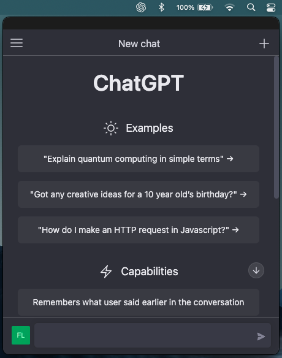

# ChatGPT Electron Tray Icon App

This is a simple app that makes ChatGPT live in your menubar.

The window will appear centered horizontally below the tray icon as a popup.
It is draggable, resizable and frameless.

## Download

- [Mac Arm64 .dmg](https://github.com/flaviodelgrosso/chatgpt-desktop-app-electron/releases/download/v0.1.0/ChatGPT-0.1.0-arm64.dmg)
- [Mac Intel .dmg](https://github.com/flaviodelgrosso/chatgpt-desktop-app-electron/releases/download/v0.1.0/ChatGPT-darwin-0.1.0-x64.dmg)

## Build

If you want build the binaries from scratch you can clone this repo, install the packages and then launch the `electron-forge make` command:

1. `git clone https://github.com/flaviodelgrosso/chatgpt-desktop-app-electron.git`

2. `yarn install`

3. `yarn make`

At the end of the process you'll find an `out` folder with the `.zip` and `.dmg` files ready for installation.

### Global shortcuts

You can use Cmd+Shift+G (Mac) or Ctrl+Shift+G (Win) to quickly open it from anywhere.

## Credit

All credit and copyrights goes to OpenAI.

## Author

@flaviodelgrosso
